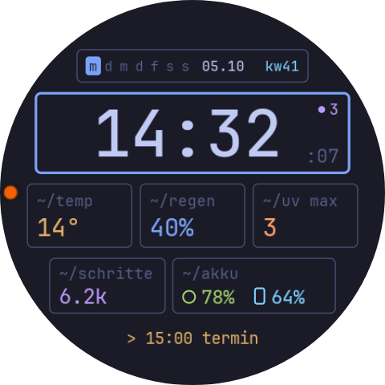
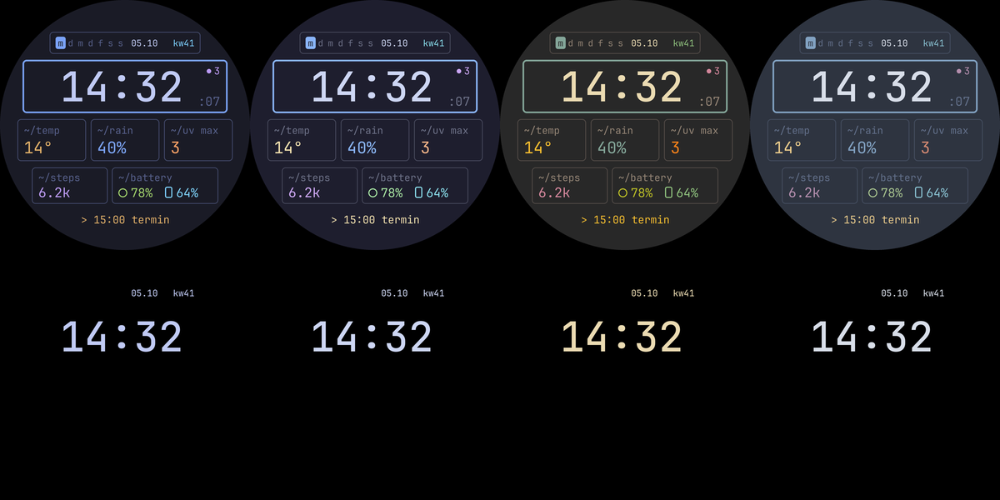
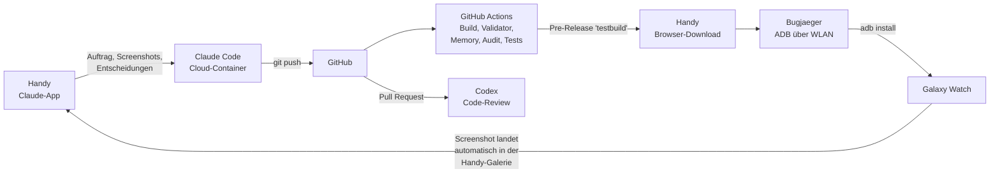

# Hyprland Watch Face

Ein Zifferblatt für die Samsung Galaxy Watch (Wear OS 5+, rund) im Stil eines
Hyprland-Desktops: Waybar oben, darunter gerahmte Kacheln in JetBrains Mono,
vier Farbthemen, Always-on-Display.

**Und ein Proof of Concept:** Das komplette Zifferblatt ist entstanden, ohne
dass ein PC eingeschaltet wurde. Planung, Code, Builds, Tests, Code-Review und
die Installation auf der eigenen Uhr liefen ausschließlich über Cloud-Sessions
von KI-Agenten, GitHub, ein Android-Handy und die Uhr selbst.

| Auf der Uhr (Galaxy Watch8) | Alle Themen, oben aktiv, unten Always-on-Display (Offline-Render) |
| --- | --- |
|  |  |

Inhalt: [Das Zifferblatt](#das-zifferblatt) ·
[Der Proof of Concept](#der-proof-of-concept) ·
[Werkzeugkette](#die-werkzeugkette) · [Vorgehen](#vorgehen) ·
[Methoden](#methoden) · [Was nicht ging](#was-nicht-ging-und-wie-es-gelöst-wurde) ·
[Bilanz](#bilanz) · [Selbst ausprobieren](#testen-nur-mit-handy-und-uhr) ·
[Entwicklung](#projektaufbau)

---

## Das Zifferblatt

- **Waybar:** Wochenleiste Montag bis Sonntag, der heutige Tag hervorgehoben wie
  ein aktiver Hyprland-Workspace, Datum und ISO-Kalenderwoche.
- **Uhrzeit-Kachel** (die „aktive“ Kachel) mit Sekunden und Zähler ungelesener
  Benachrichtigungen.
- **Wetter:** Temperatur, Regenwahrscheinlichkeit, UV-Maximum des Tages.
  Ohne Daten `--`, veraltete Daten (älter als 3 h) gedämpft.
- **Schritte** (`6.2k`), **Akku** von Uhr und Handy (Handy über eine
  Complication).
- **Nächster Termin** als Complication, frei umbelegbar.
- **Antippen** öffnet Samsung Wetter, Samsung Health bzw. die Aktion der
  Complication.
- **Vier Themen:** Tokyo Night, Catppuccin Mocha, Gruvbox Dark, Nord.
- **Always-on-Display:** nur Uhrzeit, Datum und Kalenderwoche auf Schwarz, rund
  3 % leuchtende Pixel.

Technisch ist es ein [Watch Face Format](https://developer.android.com/training/wearables/wff)-Paket
(Version 2): reine XML-Ressourcen, kein eigener Code auf der Uhr
(`android:hasCode="false"`).

## Der Proof of Concept

### Die Frage

Kann man ein echtes, auf der eigenen Uhr laufendes Wear-OS-Zifferblatt bauen,
**ohne jemals einen Rechner einzuschalten**? Also ohne lokales Android-SDK,
ohne Android Studio, ohne Emulator, ohne USB-Kabel, nur mit dem Handy als
Bedienoberfläche?

### Die Regeln

- Kein PC und kein Laptop, auch nicht zum Bauen, Signieren oder Installieren.
- Alle Arbeit am Code machen KI-Agenten in Cloud-Sessions.
- Der Mensch steuert vom Handy aus, testet auf der Uhr und entscheidet über das
  Design.
- Alles läuft über das Git-Repository. Was nicht im Repo steht, existiert nicht.

### Die Beteiligten

| Rolle | Wer/Was |
| --- | --- |
| Auftraggeber, Tester, Designentscheidungen | Mensch mit Android-Handy und Galaxy Watch8 |
| Konzept und Design | Brainstorming-Session mit einem KI-Assistenten, Ergebnis: [`docs/handover.md`](docs/handover.md) |
| Umsetzung, Recherche, Tests, Doku | [Claude Code](https://claude.ai/code) in einer Cloud-Session (Container in der Cloud, gesteuert über die Claude-App auf dem Handy) |
| Code-Review | OpenAI Codex (Cloud) am Pull Request |
| Build-Maschine und Verteilung | GitHub Actions und GitHub Releases |
| Installation auf die Uhr | [Bugjaeger Mobile ADB](https://play.google.com/store/apps/details?id=eu.sisik.hackendebug) auf dem Handy, ADB über WLAN |

## Die Werkzeugkette



Ein Testzyklus sieht so aus:

1. **Claude Code** ändert das Zifferblatt im Cloud-Container, prüft lokal so
   viel wie möglich und pusht.
2. **GitHub Actions** baut die APK mit Gradle und prüft sie:
   - offizieller XSD-Validator von Google,
   - Memory-Footprint-Tool,
   - Layout-Audit,
   - Formel-Tests.

   Danach veröffentlicht die CI die APK unter einer festen URL. Claude Code wartet
   darauf, dass das Release-Tag auf den neuen Commit zeigt. Erst dann ist klar,
   dass alle Prüfungen bestanden sind.
3. **Auf dem Handy:** APK im Browser laden, in Bugjaeger auf die Uhr
   installieren, Zifferblatt ansehen.
4. **Auf der Uhr:** Screenshot mit Home- und Zurück-Taste. Samsung legt ihn
   automatisch in der Handy-Galerie ab.
5. **In der Claude-App:** Screenshot plus Beobachtungen hochladen, weiter bei 1.

## Vorgehen

Grundlage war ein Übergabedokument ([`docs/handover.md`](docs/handover.md)) aus
einer vorherigen Brainstorming-Session. Es enthält:
- das Layout mit Koordinaten,
- ein Referenzbild als SVG ([`docs/reference.svg`](docs/reference.svg)),
- die Datenquellen, Farbthemen und Leerzustände,
- sechs offene Punkte und sieben Meilensteine.

Das Dokument schreibt ausdrücklich vor, jeden Bezeichner gegen die offizielle
Referenz zu prüfen, statt ihm zu vertrauen. Diese Vorgabe hat sich mehrfach
ausgezahlt (siehe [unten](#was-nicht-ging-und-wie-es-gelöst-wurde)).

| Runde | Meilensteine | Inhalt | Ergebnis auf der Uhr |
| --- | --- | --- | --- |
| 1 | M1, M2 | Projekt, Build-Pipeline, statisches Layout mit Beispieltexten | Pixelgenau, Grundlinien ±1 Einheit zur Berechnung |
| 2 | M3–M5 | Echte Daten, Wetter, Complications, Tap-Aktionen | Alles funktioniert, ein Schönheitsfehler: Doppelpunkt nach der Terminzeit |
| 3 | M6, M7 | Themen, Always-on-Display, echtes Vorschaubild | Themen und AOD funktionieren, Doppelpunkt noch da, AOD-Rahmen soll weg |
| 4 | Fix | Doppelpunkt-Logik verallgemeinert, AOD-Rahmen entfernt | Bestätigt |

Vier Testrunden auf der Uhr, verteilt auf zwei Tage. Jede Runde kostete den
Menschen wenige Minuten: APK laden, installieren, Screenshot, kurze Rückmeldung.
Das Handover sah einen Halt nach jedem Meilenstein vor. Für weniger Testrunden
wurden später mehrere Meilensteine pro Runde gebündelt. Jede Abweichung vom
Design wurde vorher abgefragt. Details je Meilenstein:
[`docs/milestones.md`](docs/milestones.md).

## Methoden

### Erst die Referenz, dann der Code

Für jeden Bezeichner gilt dieselbe Prüfreihenfolge:
1. die XSD-Spezifikation aus [google/watchface](https://github.com/google/watchface),
2. der Quellcode des offiziellen Validators,
3. die Seiten auf developer.android.com,
4. die offiziellen Beispiele.

Die Recherche lief zum Teil parallel über einen Sub-Agenten, während der
Haupt-Agent die Build-Umgebung aufsetzte.

### Prüfen ohne Uhr und ohne Emulator

Weil im Container kein Wear-OS-Emulator läuft (siehe unten), entstanden eigene
Prüfwerkzeuge. Sie laufen bei jedem Push in der CI:

| Werkzeug | Zweck |
| --- | --- |
| XSD-Validator (google/watchface) | Ist die XML gültiges WFF v2? Hat mehrere echte Fehler gefunden, bevor sie die Uhr erreichten. |
| Memory-Footprint-Tool (google/watchface) | Speicherbudget wie bei der Play-Store-Prüfung |
| `tools/render_preview.py` | Offline-Renderer für das Teilset von WFF, das dieses Zifferblatt nutzt (Formen, Text, Bedingungen, Transformationen, Complications, Themen, Ambient) |
| `tools/wff_expr.py` | Auswerter für WFF-Ausdrücke, also dieselben Formeln, die auf der Uhr laufen |
| `tools/audit.py` | Gestaltungsregeln aus dem Handover, siehe unten |
| `tools/test_expressions.py` | Rechnet jede Formel mit Testwerten nach (74 Fälle), siehe unten |

`tools/audit.py` prüft rund 500 Regeln aus dem Handover:
- Kachel-Ecken mindestens 6 Einheiten vom Displayrand,
- Text auf dem Display und in seiner Kachel,
- nur JetBrains Mono, Schriftgröße mindestens 15, alles klein geschrieben,
- nur Farben aus der Palette,
- je Thema das Always-on-Display: Inhalt, schwarzer Grund, unter 15 % leuchtende
  Pixel.

`tools/test_expressions.py` deckt unter anderem ab:
- die ISO-Kalenderwoche für jeden Tag von 2000 bis 2040,
- Fahrenheit-Umrechnung,
- Leerzustände,
- das Kürzen langer Termine,
- die Doppelpunkt-Logik.

Der Renderer ersetzt keinen echten Screenshot. Der erste Screenshot von der Uhr
diente deshalb zum Kalibrieren: Er bestätigte das Modell für die Textposition
auf ±1 Einheit, danach war der Renderer für Layout-Fragen verlässlich.

### Die CI als Build-Maschine und Verteiler

GitHub Actions übernimmt, was sonst ein Entwicklungsrechner täte: Android-SDK,
Gradle-Build, Signieren und Prüfen. Die Verteilung läuft über ein rollendes
Pre-Release mit fester URL. Ein fester Debug-Schlüssel im Repo
(`keystore/debug.keystore`) sorgt dafür, dass jede neue APK die alte auf der Uhr
überschreibt, ohne Deinstallieren und ohne dass das Zifferblatt neu gewählt
werden muss.

### Generierte XML statt Handarbeit, wo das Format zu eng ist

Das Layout liegt viermal in der XML, einmal pro Thema (Begründung unten). Damit
das wartbar bleibt, ist die Quelle eine Vorlage mit Farbrollen
(`watchface/watchface.template.xml`, `watchface/themes.json`). Zu lange Formeln
erzeugt ein Generator (`tools/build_watchface.py`), zum Beispiel die
`indexOf`-Ersatzsuche. Die CI prüft, dass die eingecheckte XML zur Vorlage passt.

## Was nicht ging und wie es gelöst wurde

### Die Cloud-Umgebung

| Problem | Lösung |
| --- | --- |
| `dl.google.com` war von der Netzwerk-Policy des Containers gesperrt. Damit gab es kein Android-SDK, kein Google Maven und kein Android Gradle Plugin, also keinen Gradle-Build im Container. | Der echte Build läuft in GitHub Actions. Für schnelle Proben im Container: `android.jar` aus dem öffentlichen Repo [Sable/android-platforms](https://github.com/Sable/android-platforms), `aapt2`, `zipalign` und `apksigner` aus den Ubuntu-Paketen, signiert mit dem festen Debug-Schlüssel. Das ist ein Notbau, aber er prüft, ob alle Ressourcen auflösen. |
| Ubuntus `aapt2` ist alt und kann das Ressourcenformat der API-36-`android.jar` nicht lesen. | Für den Notbau die `android.jar` von API 34 verwenden. |
| Der Build des Validators aus google/watchface braucht das Android Gradle Plugin, obwohl der Validator reines Java ist. | Eigene Mini-Gradle-Datei, die nur Maven Central braucht. Das Memory-Footprint-Tool hängt an Google-Maven-Artefakten und läuft deshalb nur in der CI. |
| Kein KVM im Container, also kein Wear-OS-Emulator. | Eigener Offline-Renderer, Audit und Formel-Tests (siehe [Methoden](#methoden)), kalibriert mit dem ersten echten Screenshot. |
| Keine Verbindung vom Container zur Uhr (`adb`). | Die Uhr hängt per ADB über WLAN am Handy (Bugjaeger). Geräteinfos wie `getprop` und `pm list packages` liefen in der Shell von Bugjaeger und kamen per Copy-and-paste zurück in den Chat. |
| CI-Logs sind zu groß, um sie regelmäßig in den Agenten-Kontext zu laden. | Die Schritte laufen mit `pipefail`, der Schrittstatus ist also das Prüfergebnis. Ob ein Lauf komplett grün war, zeigt das Release-Tag: Es wird nur am Ende eines grünen Laufs auf den neuen Commit gesetzt. |
| Das Repo war leer, es gab keinen `main` als Ziel für einen Pull Request. | `main` auf den ersten Commit (M1) gesetzt, der Pull Request enthält den Rest. |

### Annahmen im Handover, die die Referenz widerlegt hat

| Annahme | Tatsache | Lösung |
| --- | --- | --- |
| Uhrzeitformat `HH:mm` | `TimeText` erlaubt nur kleines `h` | `hh:mm` mit `hourFormat="24"` |
| `[WEEK_IN_YEAR]` liefert die ISO-Woche | Es ist `ALIGNED_WEEK_OF_YEAR` (Woche 1 = 1.–7. Januar), am 05.10.2026 also 40 statt 41 | ISO-Woche per Ausdruck aus `DAY_OF_YEAR`, `DAY_OF_WEEK` und `YEAR`, getestet für 41 Jahre |
| Eine Farbkonfiguration mit vier Optionen à zehn Farben | Eine `ColorOption` fasst in **allen** WFF-Versionen höchstens fünf Farben | Nach Rückfrage: `ListConfiguration` „Thema“, das Layout liegt einmal pro Thema in der XML, erzeugt aus einer Vorlage |
| Ein Tagesmaximum für UV ist nicht dokumentiert | Es gibt `WEATHER.DAYS.0.UV_INDEX` | Direkt verwendet, auf der Uhr mit der Samsung-Wetter-App abgeglichen |
| Texte werden an der Grundlinie positioniert | `verticalAlign` gibt es in v2 nicht, Text wird in seiner Box vertikal zentriert | Boxen aus der Schriftmetrik berechnet: Grundlinie = Boxmitte + 0,36 × Schriftgröße |

### Grenzen des Watch Face Format

| Grenze | Umgehung |
| --- | --- |
| Die Schriftfarbe ist erst ab v4 per Ausdruck änderbar. Gebraucht wird sie für den hervorgehobenen Wochentag. | Gedämpfte Buchstaben als Grundebene, darüber ein Kästchen und ein Buchstabe, die per `Transform` an die Position des heutigen Tags wandern |
| Es gibt keine String-Verkettung und kein `indexOf`. | Templates mit mehreren Parametern, `subText` mit geklemmten Indizes und verschachtelte Ternär-Ausdrücke, erzeugt vom Generator |
| `numberFormat` mit Dezimalstelle würde auf einer deutschen Uhr ein Komma setzen (`6,2k`). | Nur ganze Zahlen formatieren, den Punkt fest ins Template schreiben |

### Überraschungen auf der echten Uhr

| Beobachtung | Lösung |
| --- | --- |
| Samsungs Terminquelle liefert `<Zeit>: <Titel>`, also `> 14:00: …`. Der erste Fix erkannte nur `HH:MM:`, die Uhr zeigte aber auch relative Zeiten (`27 min.:`). | Zweiter Anlauf: Suche nach dem ersten `": "` in den ersten 16 Zeichen, unabhängig vom Zeitformat. Nach dem Codex-Review nur noch, wenn der Text mit einer Ziffer beginnt (siehe unten) |
| Die Themen ließen sich scheinbar nicht auswählen. | Bedienfrage, kein Fehler: Im Samsung-Editor wechselt man Optionen durch Wischen bzw. Drehen, nicht durch Antippen |
| Der orange Systempunkt für Benachrichtigungen erschien im Screenshot. | Gehört zu One UI Watch, nicht zum Zifferblatt. Für `preview.png` übermalt |

### Eigene Fehler, die die Prüfungen gefangen haben

- `name`-Attribut an `DigitalClock` ist ungültig. Der Validator hat es gefunden.
- `--` in einem XML-Kommentar ist verboten. Der Validator hat es gefunden.
- Die CI hätte einen fehlgeschlagenen Prüfschritt hinter `| tee log` verschluckt,
  weil GitHub ohne explizites `shell: bash` ohne `pipefail` läuft. Das fiel im
  Selbst-Audit auf, nach dem ersten Lauf. Der erste CI-Lauf hat seine Prüfungen
  also nicht wirklich bewiesen, erst der zweite.

## Code-Review durch Codex

Den Pull Request hat OpenAI Codex in einer eigenen Cloud-Session geprüft.

Codex hat die Offline-Prüfungen selbst nachgefahren:
- Generator-Check,
- Formel-Tests,
- Audit.

Android-Build, offizieller Validator und echte Uhr waren in der Review-Session
nicht verfügbar.

Zwei nicht blockierende Befunde, beide umgesetzt:

| Befund | Umsetzung |
| --- | --- |
| Die Doppelpunkt-Bereinigung traf auch Texte ohne Zeitangabe: `Abgesagt: Kino` wurde zu `abgesagt kino`. Das betrifft auch andere Datenquellen, die man dem Feld zuweisen kann. | Bereinigt wird nur noch, wenn Titel bzw. Text mit einer Ziffer beginnt, also bei `14:00` oder `27 min.`. Regressionstests für normale Titel mit Doppelpunkt ergänzt. |
| Die Anleitung für ein fünftes Thema war unvollständig: Icons entstanden nur für vier Themen, die Namens-Strings fehlten. | `make icons` und `make preview` lesen die Themen aus `themes.json`. Der Generator erzeugt die Namens-Strings (`res/values/theme_strings.xml`) und bricht ab, wenn ein Icon fehlt. In einer Kopie des Repos mit einem fünften Thema durchgespielt. |

Die beiden Agenten haben sich ergänzt. Codex fand Randfälle in der Logik und
der Doku. Claude Code hatte die Prüfwerkzeuge geschrieben, mit denen Codex das
nachvollziehen konnte.

## Bilanz

- **Ergebnis:** Alle sieben Meilensteine des Handovers sind umgesetzt und auf
  einer Galaxy Watch8 (Wear OS 6) bestätigt. Alle sechs offenen Punkte sind
  geklärt.
- **Aufwand für den Menschen:**
  - ein Handover-Dokument,
  - vier Testrunden auf der Uhr,
  - eine Designentscheidung (die Themen-Lösung),
  - ein Code-Review durch einen zweiten Agenten,
  - ein paar kurze Rückmeldungen.
- **PC eingeschaltet:** nie.
- **Was den Ansatz trägt:**
  - das Handover als verbindliche Vorgabe mit Referenzbild,
  - Prüfen gegen Referenz und Validator statt Raten,
  - ein Offline-Renderer, der mit dem ersten echten Screenshot kalibriert wurde,
  - eine CI, die zugleich Build-Maschine und Verteiler ist.
- **Wo es hakt:**
  - Was sich nur auf echter Hardware zeigt, kostet eine Testrunde, etwa wie
    Samsungs Datenquellen ihre Texte formatieren.
  - Die Netzwerk-Policy der Cloud-Umgebung kann zentrale Hosts sperren. Hier
    war es `dl.google.com`.

### Vor einer Veröffentlichung offen

- Lizenz für den eigenen Code festlegen. Die Schrift steht unter der OFL, siehe
  `docs/OFL-JetBrainsMono.txt`.
- Für den Play Store: Release-Signatur statt Debug-Schlüssel und eine eigene
  Paket-ID.

---

## Testen nur mit Handy und Uhr

Jeder Push baut in GitHub Actions die APK, prüft sie und legt sie als
Pre-Release **testbuild** ab:

- Release-Seite: <https://github.com/Syztie/HyprlandWatchface/releases/tag/testbuild>
- APK direkt: <https://github.com/Syztie/HyprlandWatchface/releases/download/testbuild/hyprland-watchface.apk>

### Einmalig einrichten

1. **Uhr:** Einstellungen → Info zur Uhr → Software-Info → *Softwareversion*
   7× antippen. Danach unter Einstellungen → Entwickleroptionen
   *ADB-Debugging* und *Kabelloses Debugging* einschalten. Uhr und Handy
   müssen im selben WLAN sein.
2. **Handy:** [Bugjaeger Mobile ADB](https://play.google.com/store/apps/details?id=eu.sisik.hackendebug)
   installieren (ADB auf dem Handy, kein PC nötig).
3. **Koppeln:**
   1. Auf der Uhr unter *Kabelloses Debugging* → *Neues Gerät koppeln*.
   2. In Bugjaeger *Pair device* wählen und IP, Port und Kopplungscode von der
      Uhr eintippen.
   3. Danach in Bugjaeger mit der IP und dem Port verbinden, die die Uhr unter
      *Kabelloses Debugging* anzeigt. Das ist ein anderer Port als beim Koppeln.

### Jeder Testlauf

1. APK über den Link oben auf dem Handy herunterladen.
2. In Bugjaeger mit der Uhr verbinden → Paket-Symbol (*Install APK*) → die
   heruntergeladene `hyprland-watchface.apk` wählen.
3. Auf der Uhr das Zifferblatt lange gedrückt halten und nach rechts wischen,
   bis **Hyprland** erscheint (sonst über *+ Hinzufügen*). Dann antippen.
4. **Screenshot:** Home- und Zurück-Taste der Uhr gleichzeitig drücken. Das Bild
   landet automatisch in der Galerie des Handys (Album *Watch*). Alternativ in
   Bugjaeger *Screenshot*.

Shell-Befehle wie `getprop` oder `pm list packages` laufen in Bugjaeger unter
*Shell*.

### Themen umschalten

Zifferblatt lange drücken → *Anpassen* → *Thema*. Dann nach oben/unten wischen
oder am Rand drehen, Antippen wählt nicht aus. In der Galaxy-Wearable-App
erscheinen die Themen zusätzlich als Voreinstellungen (Flavors).

### Complication-Felder zuweisen

Zifferblatt lange drücken → *Anpassen* → zu den Komplikationen wischen → Feld
antippen.

| Feld | Inhalt | Standard |
| --- | --- | --- |
| Handy-Akku (neben dem Handy-Symbol in `~/akku`) | Akkustand des Handys | leer, zeigt `--` |
| Nächster Termin (unterste Zeile) | beliebige Quelle mit Text | nächster Kalendertermin |

Für den Handy-Akku brauchst du eine Zusatz-App, die ihn als Complication
anbietet, z. B. [Phone Battery Complication](https://play.google.com/store/apps/details?id=com.weartools.phonebattcomp)
(auf Handy und Uhr installieren). Danach erscheint sie in der Auswahl des Felds.

## Projektaufbau

| Pfad | Inhalt |
| --- | --- |
| `watchface/watchface.template.xml` | **Quelle** des Zifferblatts (Koordinatenraum 450 × 450), Farben als `@{rolle}` |
| `watchface/themes.json` | Die zehn Farbrollen und die vier Themen (Name, Farben) |
| `app/src/main/res/raw/watchface.xml`, `app/src/main/res/values/theme_strings.xml` | Daraus erzeugt (`make generate`), nicht von Hand bearbeiten |
| `app/src/main/res/xml/watch_face_info.xml` | Vorschau, Editierbarkeit, Flavors |
| `app/src/main/res/font/` | JetBrains Mono Regular und Medium (OFL, siehe `docs/OFL-JetBrainsMono.txt`) |
| `app/src/main/res/drawable/` | `preview.png` (echter Screenshot), Themen-Icons |
| `docs/handover.md` | Das ursprüngliche Übergabedokument (Auftrag) |
| `docs/reference.svg` | Verbindliches Referenzbild |
| `docs/milestones.md` | Stand je Meilenstein, geprüfte Fakten, Abweichungen |
| `tools/` | Generator, Validator-Setup, Offline-Renderer, Audit, Formel-Tests |
| `.github/workflows/build.yml` | CI: Build, Prüfungen, Pre-Release `testbuild` |
| `keystore/debug.keystore` | Fester Debug-Schlüssel, damit Builds sich gegenseitig überschreiben können |

### Themen

Eine Farboption im Watch Face Format fasst höchstens fünf Farben, das Design
braucht zehn Rollen. Deshalb ist das Thema eine Listen-Auswahl.
`tools/build_watchface.py` schreibt jeden `<ThemeSwitch>`-Block der Vorlage
einmal pro Thema mit festen Farben in die XML.

Für neue Farben oder ein weiteres Thema in `watchface/themes.json` einen Eintrag
mit `id`, `name` und zehn Farben in der Reihenfolge von `roles` anlegen. Dann
`make icons generate` ausführen. Das erzeugt:
- das Icon,
- den Anzeigenamen (`res/values/theme_strings.xml`),
- die Listen-Option,
- den Flavor,
- die Kopie des Layouts.

## Entwicklung am Rechner (optional)

Der Proof of Concept kommt ohne PC aus, das Projekt baut aber auch klassisch
(getestet ist der Weg über die CI auf Ubuntu).

Voraussetzungen:
- JDK 17
- Android-SDK (`sdkmanager "platforms;android-36" "build-tools;36.0.0" "platform-tools"`)
- Python 3 mit Pillow (für Generator-Prüfung, Vorschau und Audit)

```sh
make generate     # res/raw/watchface.xml aus watchface/ erzeugen
make build        # ./gradlew :app:assembleDebug
make validate     # Generator aktuell?, XSD-Validator (WFF v2), Memory-Footprint, Audit, Formel-Tests
make install      # adb install -r … (Uhr per adb über WLAN verbunden)
make screenshot   # adb exec-out screencap -p > screenshots/…
make preview      # Offline-Vorschau aller Themen, aktiv und Ambient, nach build/preview/
make icons        # Themen-Icons für die Auswahl neu rendern
```

Uhr per WLAN verbinden: auf der Uhr *Kabelloses Debugging* → *Neues Gerät
koppeln*, dann `adb pair IP:PORT` mit dem Code und `adb connect IP:PORT`.

`make tools` baut den offiziellen XML-Validator und das Memory-Footprint-Tool
aus [google/watchface](https://github.com/google/watchface) (fester Commit) nach
`tools/bin/`.
