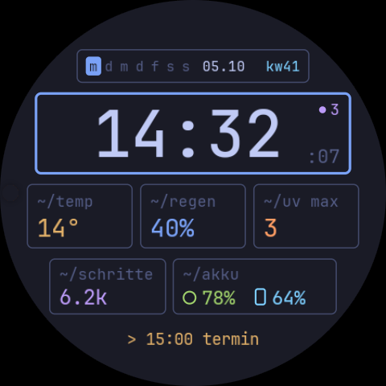

# Hyprland Watch Face

Zifferblatt für die Samsung Galaxy Watch (Wear OS 5+, rund) im Stil eines
Hyprland-Desktops: Waybar oben, darunter gerahmte Kacheln in JetBrains Mono.
Umgesetzt im [Watch Face Format](https://developer.android.com/training/wearables/wff)
Version 2, rein deklarativ (`android:hasCode="false"`).



## Projektaufbau

| Pfad | Inhalt |
| --- | --- |
| `watchface/watchface.template.xml` | **Quelle** des Zifferblatts (Koordinatenraum 450 × 450), Farben als `@{rolle}` |
| `watchface/themes.json` | Die zehn Farbrollen und die vier Themen |
| `app/src/main/res/raw/watchface.xml` | Daraus erzeugt (`make generate`), nicht von Hand bearbeiten |
| `app/src/main/res/xml/watch_face_info.xml` | Vorschau, Editierbarkeit, Flavors |
| `app/src/main/res/font/` | JetBrains Mono Regular und Medium (OFL, siehe `docs/OFL-JetBrainsMono.txt`) |
| `docs/reference.svg` | Verbindliches Referenzbild |
| `docs/milestones.md` | Stand je Meilenstein, Abweichungen, offene Punkte |
| `tools/` | Validator-Setup, Offline-Renderer, Layout-Audit |
| `keystore/debug.keystore` | Fester Debug-Schlüssel, damit lokale und CI-Builds sich gegenseitig überschreiben können |

## Themen und Always-on-Display

Vier Themen: Tokyo Night (Standard), Catppuccin Mocha, Gruvbox Dark, Nord.
Umschalten auf der Uhr: Zifferblatt lange drücken → *Anpassen* → *Thema*. In
der Galaxy-Wearable-App erscheinen die Themen zusätzlich als Voreinstellungen
(Flavors).

Eine Farboption im Watch Face Format fasst höchstens fünf Farben, das Design
braucht zehn Rollen. Deshalb ist das Thema eine Listen-Auswahl, und
`tools/build_watchface.py` schreibt jeden `<ThemeSwitch>`-Block der Vorlage
einmal pro Thema mit festen Farben in die XML. Neue Farben oder ein fünftes
Thema: `watchface/themes.json` ändern, `make icons generate` ausführen.

Im Always-on-Display bleiben auf schwarzem Grund nur Uhrzeit, Datum und
Kalenderwoche (rund 3 % leuchtende Pixel).

## Testen nur mit Handy und Uhr

Jeder Push baut in GitHub Actions die APK, prüft sie (XML-Validator,
Memory-Footprint, Layout-Audit) und legt sie als Pre-Release **testbuild** ab:

- Release-Seite: <https://github.com/Syztie/HyprlandWatchface/releases/tag/testbuild>
- APK direkt: <https://github.com/Syztie/HyprlandWatchface/releases/download/testbuild/hyprland-watchface.apk>

### Einmalig einrichten

1. **Uhr:** Einstellungen → Info zur Uhr → Software-Info → *Softwareversion* 7× antippen.
   Danach unter Einstellungen → Entwickleroptionen *ADB-Debugging* und
   *Kabelloses Debugging* einschalten. Uhr und Handy müssen im selben WLAN sein.
2. **Handy:** [Bugjaeger Mobile ADB](https://play.google.com/store/apps/details?id=eu.sisik.hackendebug)
   installieren (ADB auf dem Handy, kein PC nötig).
3. **Koppeln:** Auf der Uhr unter *Kabelloses Debugging* → *Neues Gerät koppeln*.
   In Bugjaeger *Pair device* wählen und IP, Port und Kopplungscode von der Uhr
   eintippen. Danach in Bugjaeger mit der IP und dem Port verbinden, die die Uhr
   unter *Kabelloses Debugging* anzeigt (anderer Port als beim Koppeln).

### Jeder Testlauf

1. APK über den Link oben auf dem Handy herunterladen.
2. In Bugjaeger mit der Uhr verbinden → Paket-Symbol (*Install APK*) → die
   heruntergeladene `hyprland-watchface.apk` wählen.
3. Auf der Uhr das Zifferblatt lange gedrückt halten, nach rechts wischen bis
   **Hyprland** erscheint (sonst über *+ Hinzufügen*) und antippen.
4. **Screenshot:** Home- und Zurück-Taste der Uhr gleichzeitig drücken. Das Bild
   landet automatisch in der Galerie des Handys (Album *Watch*). Alternativ in
   Bugjaeger *Screenshot*.
5. Screenshot hier im Chat hochladen.

Shell-Befehle (z. B. `getprop`, `pm list packages`) laufen in Bugjaeger unter
*Shell*.

## Complication-Felder zuweisen

Das Zifferblatt hat zwei Felder, die du auf der Uhr belegst: Zifferblatt lange
drücken → *Anpassen* → zu den Komplikationen wischen → Feld antippen.

| Feld | Inhalt | Standard |
| --- | --- | --- |
| Handy-Akku (neben dem Handy-Symbol in `~/akku`) | Akkustand des Handys | leer, zeigt `--` |
| Nächster Termin (unterste Zeile) | beliebige Quelle mit Text | nächster Kalendertermin |

Für den Handy-Akku brauchst du eine Zusatz-App, die ihn als Complication
anbietet, z. B. [Phone Battery Complication](https://play.google.com/store/apps/details?id=com.weartools.phonebattcomp)
(auf Handy und Uhr installieren). Danach erscheint sie in der Auswahl des Felds.

## Entwicklung am Rechner (Arch Linux)

Voraussetzungen: JDK 17, Android-SDK (`sdkmanager "platforms;android-36" "build-tools;36.0.0" "platform-tools"`),
Python 3 mit Pillow (für Vorschau und Audit).

```sh
make generate     # res/raw/watchface.xml aus watchface/ erzeugen
make build        # ./gradlew :app:assembleDebug
make validate     # erzeugte XML aktuell?, XSD-Validator (WFF v2), Memory-Footprint, Audit, Ausdruckstests
make install      # adb install -r … (Uhr per adb über WLAN verbunden)
make screenshot   # adb exec-out screencap -p > screenshots/…
make preview      # Offline-Vorschau aller Themen, aktiv und Ambient, nach build/preview/
make icons        # Themen-Icons für die Auswahl neu rendern
```

Uhr per WLAN verbinden: auf der Uhr *Kabelloses Debugging* → *Neues Gerät
koppeln*, dann `adb pair IP:PORT` mit dem Code und `adb connect IP:PORT`.

`make tools` baut den offiziellen XML-Validator und das Memory-Footprint-Tool
aus [google/watchface](https://github.com/google/watchface) (fester Commit) nach
`tools/bin/`.

### Offline-Vorschau und Audit

`tools/render_preview.py` zeichnet das Teilset von WFF nach, das dieses
Zifferblatt nutzt, mit Beispieldaten aus `tools/sample_data.py`. Das ersetzt
keinen Screenshot von der Uhr, reicht aber für Layout-Vergleiche mit
`docs/reference.svg`. `tools/audit.py` prüft die Gestaltungsregeln, die der
XSD-Validator nicht sieht: Abstand der Kachel-Ecken zum Displayrand, Text auf
dem Display und in seiner Kachel, Schriftart und -größe, Kleinschreibung,
Palette und je Thema das Always-on-Display (nur Uhrzeit, Datum, Woche; schwarzer
Grund; unter 15 % leuchtende Pixel). `tools/test_expressions.py` rechnet alle
Ausdrücke mit Testwerten nach, z. B. die ISO-Woche für jeden Tag 2000–2040.
