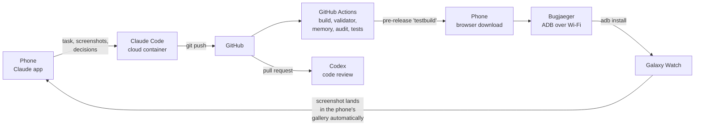

# Hyprland Watch Face

**English** | [Deutsch](README.de.md)

A watch face for the Samsung Galaxy Watch (Wear OS 5+, round) styled like a
Hyprland desktop: a Waybar at the top, framed tiles in JetBrains Mono below,
four color themes and an always-on display.

**It is also a proof of concept:** the whole watch face was built without
turning on a PC. Planning, code, builds, tests, code review and installation on
the watch ran entirely through cloud sessions of AI agents, GitHub, an Android
phone and the watch itself.

| On the watch (Galaxy Watch8, milestone 2, still with German tile titles) | All themes, active on top, always-on display below (offline render) |
| --- | --- |
|  |  |

Contents: [The watch face](#the-watch-face) ·
[The proof of concept](#the-proof-of-concept) ·
[Tool chain](#the-tool-chain) · [How it went](#how-it-went) ·
[Methods](#methods) · [What did not work](#what-did-not-work-and-how-it-was-solved) ·
[Results](#results) · [Try it yourself](#testing-with-just-a-phone-and-a-watch) ·
[Development](#project-layout)

---

## The watch face

- **Waybar:** a Monday-to-Sunday weekday strip with today highlighted like an
  active Hyprland workspace, the date and the ISO week number.
- **Time tile** (the "active" tile) with seconds and an unread notification
  count.
- **Weather:** temperature, chance of rain, the day's maximum UV index. `--`
  without data, muted when the data is older than 3 hours.
- **Steps** (`6.2k`) and **battery** of watch and phone (the phone through a
  complication).
- **Next event** as a complication that can be reassigned.
- **Tapping** opens Samsung Weather, Samsung Health or the complication's own
  action.
- **Four themes:** Tokyo Night, Catppuccin Mocha, Gruvbox Dark, Nord.
- **Always-on display:** only time, date and week number on black, about 3 %
  lit pixels.
- **Language:** tile titles in English (`~/temp`, `~/rain`, `~/uv max`,
  `~/steps`, `~/battery`, `> free`). Date (`06.10`), week number (`kw41`) and
  weekday strip (`m d m d f s s`) keep their German format. The texts in the
  watch's editor ("Theme", "Phone battery", "Next event") are English, with a
  German translation for watches set to German.

Technically it is a [Watch Face Format](https://developer.android.com/training/wearables/wff)
package (version 2): XML resources only, no code of its own on the watch
(`android:hasCode="false"`).

## The proof of concept

### The question

Can you build a real Wear OS watch face that runs on your own watch **without
ever turning on a computer**? No local Android SDK, no Android Studio, no
emulator, no USB cable, with the phone as the only user interface?

### The rules

- No PC or laptop, not even for building, signing or installing.
- All work on the code is done by AI agents in cloud sessions.
- The human steers from the phone, tests on the watch and makes the design
  decisions.
- Everything goes through the Git repository. What is not in the repo does not
  exist.

### Who did what

| Role | Who/What |
| --- | --- |
| Client, tester, design decisions | A human with an Android phone and a Galaxy Watch8 (the project ran in German) |
| Concept and design | A brainstorming session with an AI assistant, resulting in [`docs/handover.md`](docs/handover.md) (German) |
| Implementation, research, tests, docs | [Claude Code](https://claude.ai/code) in a cloud session (a container in the cloud, driven from the Claude app on the phone) |
| Code review | OpenAI Codex (cloud) on the pull request |
| Build machine and distribution | GitHub Actions and GitHub Releases |
| Installation on the watch | [Bugjaeger Mobile ADB](https://play.google.com/store/apps/details?id=eu.sisik.hackendebug) on the phone, ADB over Wi-Fi |

## The tool chain



One test cycle:

1. **Claude Code** changes the watch face in the cloud container, checks as
   much as it can locally and pushes.
2. **GitHub Actions** builds the APK with Gradle and checks it:
   - Google's official XSD validator,
   - the memory footprint tool,
   - the layout audit,
   - the expression tests.

   The CI then publishes the APK at a fixed URL. Claude Code waits until the
   release tag points at the new commit. Only then is it certain that every
   check passed.
3. **On the phone:** download the APK in the browser, install it on the watch
   with Bugjaeger, look at the watch face.
4. **On the watch:** take a screenshot with the Home and Back keys. Samsung puts
   it into the phone's gallery automatically.
5. **In the Claude app:** upload the screenshot with observations, back to 1.

## How it went

The starting point was a handover document ([`docs/handover.md`](docs/handover.md))
from an earlier brainstorming session. It contains:
- the layout with coordinates,
- a reference image as SVG ([`docs/reference.svg`](docs/reference.svg)),
- data sources, color themes and empty states,
- six open questions and seven milestones.

The document explicitly requires checking every identifier against the
official reference instead of trusting it. That paid off several times (see
[below](#what-did-not-work-and-how-it-was-solved)).

| Round | Milestones | Content | Result on the watch |
| --- | --- | --- | --- |
| 1 | M1, M2 | Project, build pipeline, static layout with sample texts | Pixel-accurate, baselines within ±1 unit of the calculation |
| 2 | M3–M5 | Live data, weather, complications, tap actions | Everything works, one cosmetic issue: a colon after the event time |
| 3 | M6, M7 | Themes, always-on display, real preview image | Themes and AOD work, colon still there, AOD frame should go |
| 4 | Fix | Generalized colon logic, AOD frame removed | Confirmed |

Four test rounds on the watch over two days. Each round took the human a few
minutes: download the APK, install, screenshot, short feedback. The handover
asked for a stop after every milestone. To save test rounds, several
milestones were later bundled into one round. Every deviation from the design
was asked about first. Details per milestone, in German:
[`docs/milestones.md`](docs/milestones.md).

## Methods

### Reference first, code second

Every identifier is checked in the same order:
1. the XSD specification from [google/watchface](https://github.com/google/watchface),
2. the source code of the official validator,
3. the pages on developer.android.com,
4. the official samples.

Part of the research ran in parallel in a sub-agent while the main agent set up
the build environment.

### Testing without a watch or emulator

Since no Wear OS emulator runs in the container (see below), dedicated checking
tools were written. They run in CI on every push:

| Tool | Purpose |
| --- | --- |
| XSD validator (google/watchface) | Is the XML valid WFF v2? Found several real mistakes before they reached the watch. |
| Memory footprint tool (google/watchface) | Memory budget as in the Play Store review |
| `tools/render_preview.py` | Offline renderer for the subset of WFF this watch face uses (shapes, text, conditions, transforms, complications, themes, ambient) |
| `tools/wff_expr.py` | Evaluator for WFF expressions, the same formulas that run on the watch |
| `tools/audit.py` | Design rules from the handover, see below |
| `tools/test_expressions.py` | Recomputes every formula with test values (over 70 cases), see below |

`tools/audit.py` checks about 500 rules from the handover:
- tile corners at least 6 units from the display edge,
- text on the display and inside its tile,
- only JetBrains Mono, font size at least 15, everything lower case,
- only colors from the palette,
- per theme, the always-on display: content, black background, under 15 % lit
  pixels, and a theme icon that shows the theme.

`tools/test_expressions.py` covers, among other things:
- the ISO week number for every day from 2000 to 2040,
- Fahrenheit conversion,
- empty states,
- truncating long events,
- the colon logic.

The renderer does not replace a real screenshot. The first screenshot from the
watch was used for calibration: it confirmed the text position model within
±1 unit, and after that the renderer was reliable for layout questions.

### CI as build machine and distribution

GitHub Actions does what a development machine would otherwise do: Android SDK,
Gradle build, signing and checking. Distribution runs through a rolling
pre-release with a fixed URL. A fixed debug key in the repo
(`keystore/debug.keystore`) makes every new APK replace the old one on the
watch, without uninstalling and without picking the watch face again.

### Generated XML where the format is too tight

The layout exists four times in the XML, once per theme (reason below). To keep
that maintainable, the source is a template with color roles
(`watchface/watchface.template.xml`, `watchface/themes.json`). A generator
(`tools/build_watchface.py`) also writes the formulas that are too long to
maintain by hand, such as the `indexOf` replacement. CI checks that the
committed XML matches the template.

## What did not work and how it was solved

### The cloud environment

| Problem | Solution |
| --- | --- |
| The container's network policy blocked `dl.google.com`. That meant no Android SDK, no Google Maven and no Android Gradle Plugin, so no Gradle build in the container. | The real build runs in GitHub Actions. For quick checks in the container: `android.jar` from the public repo [Sable/android-platforms](https://github.com/Sable/android-platforms), `aapt2`, `zipalign` and `apksigner` from the Ubuntu packages, signed with the fixed debug key. It is a stopgap build, but it proves that all resources resolve. |
| Ubuntu's `aapt2` is old and cannot read the resource format of the API 36 `android.jar`. | Use the API 34 `android.jar` for the stopgap build. |
| Building the validator from google/watchface needs the Android Gradle Plugin, although the validator is plain Java. | A small Gradle file that only needs Maven Central. The memory footprint tool depends on Google Maven artifacts and therefore runs in CI only. |
| No KVM in the container, so no Wear OS emulator. | Own offline renderer, audit and expression tests (see [Methods](#methods)), calibrated with the first real screenshot. |
| No connection from the container to the watch (`adb`). | The watch is connected to the phone via ADB over Wi-Fi (Bugjaeger). Device information such as `getprop` and `pm list packages` ran in Bugjaeger's shell and came back to the chat via copy and paste. |
| CI logs are too large to load into the agent's context regularly. | Steps run with `pipefail`, so the step status is the check result. The release tag shows whether a run was fully green: it only moves to the new commit at the end of a green run. |
| The repo was empty, there was no `main` to target with a pull request. | `main` was created at the first commit (M1), the pull request holds the rest. |

### Assumptions in the handover that the reference disproved

| Assumption | Fact | Solution |
| --- | --- | --- |
| Time format `HH:mm` | `TimeText` only allows a lower-case `h` | `hh:mm` with `hourFormat="24"` |
| `[WEEK_IN_YEAR]` returns the ISO week | It is `ALIGNED_WEEK_OF_YEAR` (week 1 = January 1–7), so 40 instead of 41 on 2026-10-05 | ISO week computed by an expression from `DAY_OF_YEAR`, `DAY_OF_WEEK` and `YEAR`, tested for 41 years |
| One color configuration with four options of ten colors each | A `ColorOption` holds at most five colors in **every** WFF version | After asking: a `ListConfiguration` "theme", with the layout once per theme in the XML, generated from a template |
| A daily UV maximum is not documented | `WEATHER.DAYS.0.UV_INDEX` exists | Used directly, cross-checked on the watch against the Samsung Weather app |
| Text is positioned by its baseline | `verticalAlign` does not exist in v2, text is centered vertically in its box | Boxes computed from the font metrics: baseline = box center + 0.36 × font size |

### Limits of the Watch Face Format

| Limit | Workaround |
| --- | --- |
| The font color can only be changed by an expression from v4 on. It is needed for the highlighted weekday. | Muted letters as the base layer, with a box and a letter on top that move to today's position via `Transform` |
| There is no string concatenation and no `indexOf`. | Templates with several parameters, `subText` with clamped indices and nested ternary expressions, written by the generator |
| `numberFormat` with a decimal place would print a comma on a German watch (`6,2k`). | Format whole numbers only and put the dot into the template |

### Surprises on the real watch

| Observation | Solution |
| --- | --- |
| Samsung's calendar source sends `<time>: <title>`, so `> 14:00: …`. The first fix only recognized `HH:MM:`, but the watch also showed relative times (`27 min.:`). | Second attempt: look for the first `": "` within the first 16 characters, whatever the time format. After the Codex review only when the text starts with a digit (see below) |
| The themes seemed impossible to select. | A usage question, not a bug: in Samsung's editor you change options by swiping or rotating, not by tapping |
| The orange system dot for notifications appeared in the screenshot. | It belongs to One UI Watch, not to the watch face. Painted over for `preview.png` |

### Own mistakes caught by the checks

- A `name` attribute on `DigitalClock` is invalid. The validator found it.
- `--` inside an XML comment is not allowed. The validator found it.
- CI would have swallowed a failing check behind `| tee log`, because GitHub
  runs without `pipefail` unless `shell: bash` is set explicitly. This came up
  in a self-audit after the first run. So the first CI run did not really prove
  its checks, only the second one did.
- The first implementation of the second Codex finding would have produced an
  empty icon for a new theme, because the icons were rendered from the old XML.
  The dry run only checked that the file existed. It came up while switching to
  English tile titles, when the icons still showed the old titles. Since then
  `make icons` generates the XML first, and the audit checks the background of
  every icon.

## Code review by Codex

OpenAI Codex reviewed the pull request in a separate cloud session.

Codex re-ran the offline checks itself:
- generator check,
- expression tests,
- audit.

The Android build, the official validator and a real watch were not available
in the review session.

Two non-blocking findings, both addressed:

| Finding | Change |
| --- | --- |
| The colon cleanup also hit texts without a time: `Abgesagt: Kino` became `abgesagt kino`. This also affects other data sources that can be assigned to the slot. | The cleanup only applies when the title or text starts with a digit, i.e. `14:00` or `27 min.`. Regression tests for normal titles containing a colon were added. |
| The instructions for a fifth theme were incomplete: icons were only made for four themes, and the name strings were missing. | `make icons` generates the XML first and then renders one icon per theme from `themes.json`. The generator writes the name strings (`res/values/theme_strings.xml`). The CI check reports missing icons, the audit checks their content. Tried out with a fifth theme in a copy of the repo. |

The two agents complemented each other. Codex found edge cases in the logic and
the docs. Claude Code had written the checking tools that let Codex verify
them.

## Results

- **Outcome:** all seven milestones of the handover are implemented and
  confirmed on a Galaxy Watch8 (Wear OS 6). All six open questions are
  resolved.
- **Effort for the human:**
  - one handover document,
  - four test rounds on the watch,
  - one design decision (the theme solution),
  - one code review by a second agent,
  - a few short pieces of feedback.
- **PC turned on:** never.
- **What makes the approach work:**
  - the handover as a binding specification with a reference image,
  - checking against the reference and the validator instead of guessing,
  - an offline renderer calibrated with the first real screenshot,
  - a CI that is both build machine and distribution channel.
- **Where it gets stuck:**
  - Anything that only shows on real hardware costs a test round, for example
    how Samsung's data sources format their texts.
  - The cloud environment's network policy can block central hosts. Here it was
    `dl.google.com`.

### Open before publishing

- Choose a license for the code. The font is under the OFL, see
  `docs/OFL-JetBrainsMono.txt`.
- For the Play Store: a release signature instead of the debug key and a
  package ID of your own.

---

## Testing with just a phone and a watch

Every push builds the APK in GitHub Actions, checks it and publishes it as the
pre-release **testbuild**:

- Release page: <https://github.com/Syztie/HyprlandWatchface/releases/tag/testbuild>
- APK directly: <https://github.com/Syztie/HyprlandWatchface/releases/download/testbuild/hyprland-watchface.apk>

### One-time setup

1. **Watch:** Settings → About watch → Software information → tap *Software
   version* 7 times. Then turn on *ADB debugging* and *Wireless debugging* under
   Settings → Developer options. Watch and phone must be on the same Wi-Fi.
2. **Phone:** install [Bugjaeger Mobile ADB](https://play.google.com/store/apps/details?id=eu.sisik.hackendebug)
   (ADB on the phone, no PC needed).
3. **Pair:**
   1. On the watch, go to *Wireless debugging* → *Pair new device*.
   2. In Bugjaeger, choose *Pair device* and enter the IP, port and pairing
      code shown on the watch.
   3. Then connect in Bugjaeger to the IP and port the watch shows under
      *Wireless debugging*. That port differs from the pairing port.

### Every test run

1. Download the APK on the phone from the link above.
2. Connect to the watch in Bugjaeger → package icon (*Install APK*) → choose
   the downloaded `hyprland-watchface.apk`.
3. On the watch, long-press the watch face and swipe right until **Hyprland**
   appears (otherwise via *+ Add*). Then tap it.
4. **Screenshot:** press the watch's Home and Back keys at the same time. The
   image lands in the phone's gallery automatically (album *Watch*).
   Alternatively use *Screenshot* in Bugjaeger.

Shell commands such as `getprop` or `pm list packages` run in Bugjaeger under
*Shell*.

### Switching themes

Long-press the watch face → *Customize* → *Theme*. Then swipe up/down or rotate
the bezel; tapping does not select. In the Galaxy Wearable app the themes also
appear as presets (flavors).

### Assigning the complication slots

Long-press the watch face → *Customize* → swipe to the complications → tap a
slot.

| Slot | Content | Default |
| --- | --- | --- |
| *Phone battery* (next to the phone icon in `~/battery`) | The phone's battery level | empty, shows `--` |
| *Next event* (bottom line) | Any source that provides text | next calendar event, `> free` without one |

The phone battery needs an additional app that offers it as a complication,
for example [Phone Battery Complication](https://play.google.com/store/apps/details?id=com.weartools.phonebattcomp)
(install on both phone and watch). It then appears in the slot's picker.

## Project layout

| Path | Content |
| --- | --- |
| `watchface/watchface.template.xml` | **Source** of the watch face (450 × 450 coordinate space), colors written as `@{role}` |
| `watchface/themes.json` | The ten color roles and the four themes (name, colors) |
| `app/src/main/res/raw/watchface.xml`, `app/src/main/res/values/theme_strings.xml` | Generated from those (`make generate`), do not edit by hand |
| `app/src/main/res/xml/watch_face_info.xml` | Preview, editability, flavors |
| `app/src/main/res/font/` | JetBrains Mono Regular and Medium (OFL, see `docs/OFL-JetBrainsMono.txt`) |
| `app/src/main/res/drawable/` | `preview.png` (real screenshot), theme icons |
| `app/src/main/res/values/`, `values-de/` | Texts for the watch's editor, English by default, German as translation |
| `docs/handover.md` | The original handover document (the brief, in German) |
| `docs/reference.svg` | Binding reference image |
| `docs/milestones.md` | Work log per milestone, verified facts, deviations (in German) |
| `README.md`, `README.de.md` | This documentation in English and German, `tools/check_readmes.py` keeps both structured the same |
| `tools/` | Generator, validator setup, offline renderer, audit, expression tests, README check |
| `.github/workflows/build.yml` | CI: build, checks, pre-release `testbuild` |
| `keystore/debug.keystore` | Fixed debug key, so builds can replace each other |

### Themes

A color option in the Watch Face Format holds at most five colors, the design
needs ten roles. So the theme is a list option. `tools/build_watchface.py`
writes every `<ThemeSwitch>` block of the template into the XML once per theme,
with fixed colors.

For new colors or another theme, add an entry to `watchface/themes.json` with
`id`, `name` and ten colors in the order of `roles`. Then run `make icons`.
That generates:
- the icon,
- the display name (`res/values/theme_strings.xml`),
- the list option,
- the flavor,
- the copy of the layout.

## Development on a computer (optional)

The proof of concept needs no PC, but the project also builds the classic way
(the tested path is CI on Ubuntu).

Requirements:
- JDK 17
- Android SDK (`sdkmanager "platforms;android-36" "build-tools;36.0.0" "platform-tools"`)
- Python 3 with Pillow (for the generator check, previews and audit)

```sh
make generate     # generate res/raw/watchface.xml from watchface/
make build        # ./gradlew :app:assembleDebug
make validate     # generator up to date?, XSD validator (WFF v2), memory footprint, audit, expression tests, README check
make install      # adb install -r … (watch connected via adb over Wi-Fi)
make screenshot   # adb exec-out screencap -p > screenshots/…
make preview      # offline previews of all themes, active and ambient, into build/preview/
make icons        # generate the XML, then re-render the theme icons
make docs         # README.md and README.de.md structured the same, links valid
```

To connect the watch over Wi-Fi: on the watch, *Wireless debugging* → *Pair new
device*, then `adb pair IP:PORT` with the code and `adb connect IP:PORT`.

`make tools` builds the official XML validator and the memory footprint tool
from [google/watchface](https://github.com/google/watchface) (pinned commit)
into `tools/bin/`.
